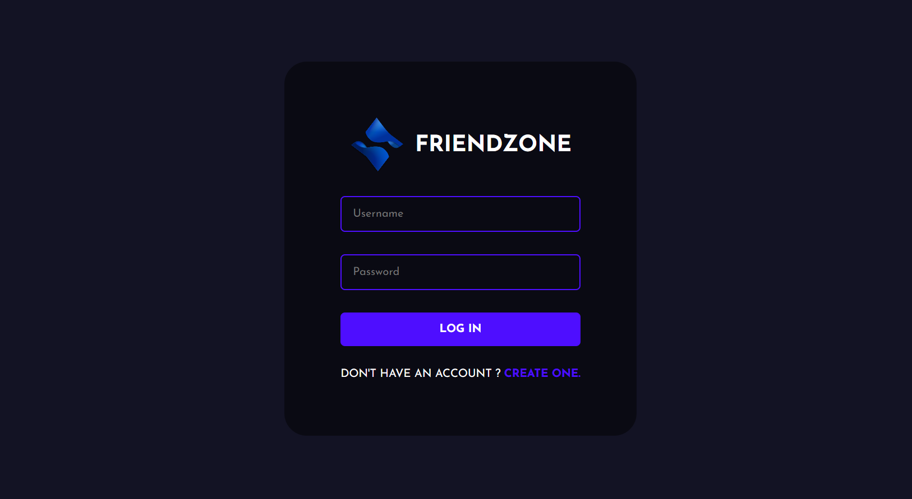
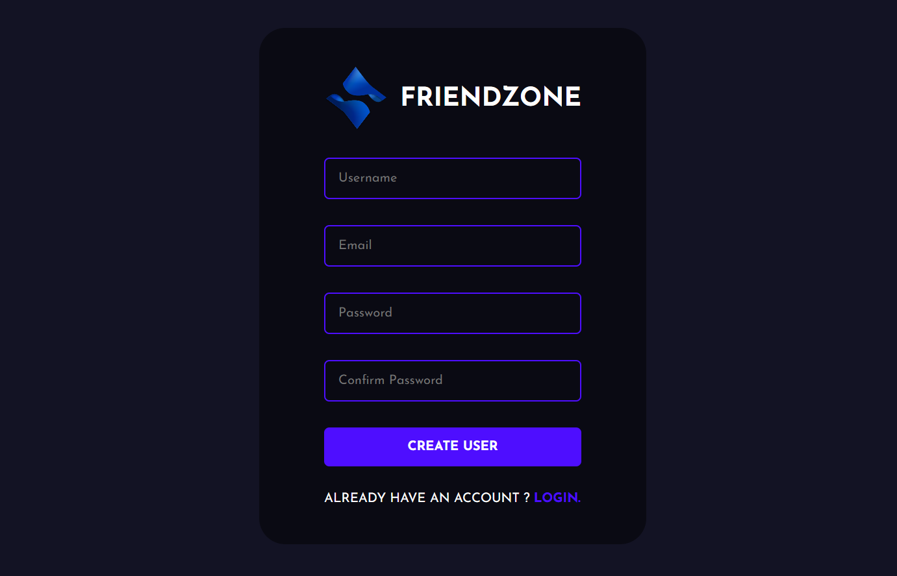
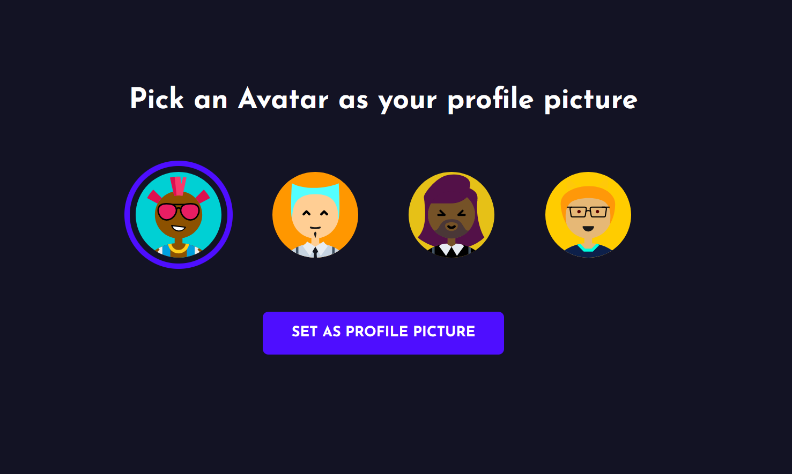
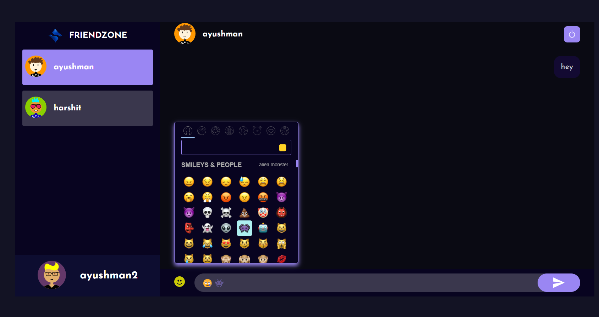
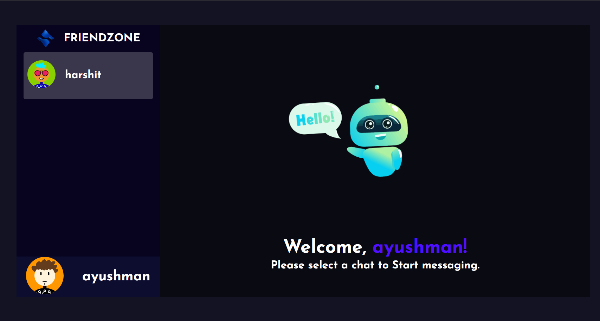

# FriendZone - Chat Application 
FriendZone is chat application build with the power of MERN Stack. You can find the tutorial [here](https://www.youtube.com/watch?v=otaQKODEUFs)








Now install the dependencies
```shell
cd server
cd ..
cd public

npm start
```

now open localhost:3000 in your browser.# chat-app
